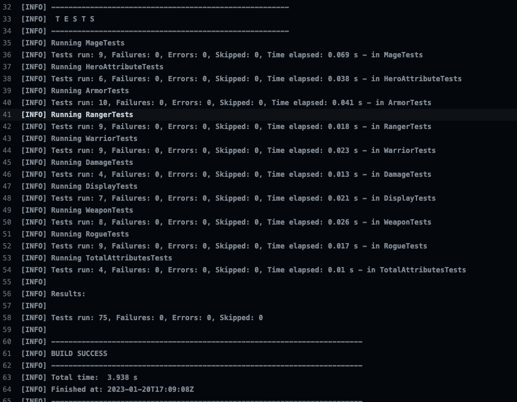

# RPGHeroes - Assignment 1

## Description

First Assignment for the Full-stack Development with Java bootcamp from Noroff. The task was to build a console application in Java, I have opted to go for a **Maven build**. The application is reponsible from creating various *hero classes* with attributes which increase at different rates as the character gains levels. Heroes can wear equipment, such as *armor* and *weapons* which when equipped will alter the power of the hero. Certain hero classes can equip certain item types. When invalid items are being equipped, *custom exceptions* will be thrown. 

The functionality of the application is tested extensively through unit testing (using **JUnit**) for all methods that belong to the various classes.

## How to run

Although there is a main function which is able to run all of the required methods, no actual output is returned. The task for this assignment is to return a unit test report, which is automated to be created on every push for this repo. To find this test report, go to the **Github Actions** tab and click on the most recent action. Click once more on the *build-test* action to land on a page where you can see all the steps taken. If you unfold the *Run Unit Test* step, you can see a report as seen in the picture below:

## Structure

The application is structured in three packages:

1. heroes: All hero related classes
2. items: All equipment related classes
3. utilities: The two custom exception classes and a HeroAttribute object class 

Then there is also the test folder:
  Test classes have been created for each of the classes with unit tests for all import methods.

Configuration for Maven and JUnit has been done in the pom.xml file

